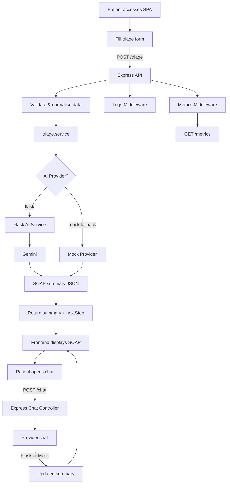

# Triage Flow Diagram

```mermaid
flowchart TD
    A[Patient accesses SPA] --> B[Fill triage form]
    B -->|POST /triage| C[Express API]
    C --> D[Validate & normalise data]
    D --> E[triage.service]
    E --> F{AI Provider?}
    F -->|flask| G[Flask AI Service]
    G --> H[Gemini]
    F -->|mock fallback| I[Mock Provider]
    H --> J[SOAP summary JSON]
    I --> J
    J --> K[Return summary + nextStep]
    K --> L[Frontend displays SOAP]
    L --> M[Patient opens chat]
    M -->|POST /chat| N[Express Chat Controller]
    N --> O[Provider.chat]
    O -->|Flask or Mock| P[Updated summary]
    P --> L

    C --> Q[Logs Middleware]
    C --> R[Metrics Middleware]
    R --> S[GET /metrics]
```
